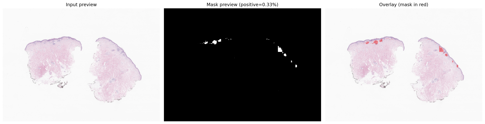

# WSI Lesion Segmentation Pipeline

A production-ready lesion segmentation pipeline for whole-slide images.
It uses patch-based inference with optional tissue filtering and exports tiled TIFF masks.

## What This Repository Provides

- A CLI for local segmentation runs (`wsi-segment` or `python main.py`)
- Config-driven behavior via `config/config.yaml`
- Optional Prefect flow serving (`wsi-prefect`)
- A visualization helper (`scripts/visualize_mask.py`) to inspect mask overlays

## Setup

### 1) System prerequisites

Install OpenSlide (required by `openslide-python`):

```bash
# macOS
brew install openslide

# Debian/Ubuntu
sudo apt-get update
sudo apt-get install -y libopenslide0

# Fedora/RHEL/CentOS (dnf)
sudo dnf install -y openslide openslide-tools

# Arch Linux
sudo pacman -S openslide
```

Windows: prefer running this pipeline through Docker or WSL2 (Ubuntu), then use the Debian/Ubuntu install commands above inside WSL2.

Use Python 3.10+.

### 2) Install project dependencies


Option A: `pip` + virtual environment

```bash
python -m venv .venv
source .venv/bin/activate
pip install -e .
```


Option B: `uv`

```bash
uv sync
```


### 3) Add your model file

Place your TorchScript model at the configured location:

```bash
mkdir -p models
cp /path/to/model.pt models/model.pt
```

Default model path is configured in `config/config.yaml`.

### 4) Optional: Docker runtime

```bash
docker build -t wsi-pipeline .
docker run --rm \
  -v /path/to/wsis:/data/wsi \
  -v /path/to/outputs:/data/outputs \
  -v /path/to/models:/app/models \
  wsi-pipeline \
  /data/wsi/slide.svs /data/outputs/mask.tiff --config config/config.yaml
```

## Input assumptions

- WSI input: expects a whole-slide image file (for example `.svs`; other OpenSlide-supported formats may work).
- Model input: expects a TorchScript model file (`.pt`) at `models/model.pt` (or a path set in `config/config.yaml`).
- The example path `data/slide.svs` is only a convention for this README; your WSI can be stored anywhere as long as you pass its actual path to the CLI/Prefect run.

## Usage

You can run the pipeline in two ways:

### Option 1: Run directly (without Prefect)

Single command run:

```bash
wsi-segment data/slide.svs outputs/mask.tiff --config config/config.yaml
```

Equivalent entrypoint:

```bash
python main.py data/slide.svs outputs/mask.tiff --config config/config.yaml
```

Useful CLI options:

- `--config`, `-c`: load YAML configuration
- `--model`, `-m`: override model path
- `--batch-size`, `-b`: override inference batch size
- `--device`, `-d`: override compute device (`cpu`, `cuda`, `cuda:0`, `mps`, `auto`)
- `--no-tissue-mask`: process all patches (including likely background)
- `--log-level`: set runtime logging level

### Option 2: Run with Prefect (client/server)

1) Start Prefect server and UI (Terminal 1):

```bash
prefect server start
```

2) Serve the deployment (Terminal 2):

```bash
wsi-prefect serve --deployment-name wsi-segmentation --concurrency-limit 1
```

3) Trigger a run from the client:

```bash
prefect deployment run "wsi-segmentation-flow/wsi-segmentation" \
  --param wsi_path="data/slide.svs" \
  --param output_path="outputs/mask.tiff" \
  --param config="config/config.yaml"
```

## Preflight checks

Before inference starts, the pipeline runs fail-fast checks to avoid expensive partial runs:

- Verifies the model file exists and is readable
- Verifies the WSI input exists, is readable, and can be opened by OpenSlide
- Verifies the output directory can be created/written
- Estimates required disk space (temp memmap + output + safety buffer) and fails early if free space is too low

If one of these checks fails, the run exits immediately with a clear error message.


## Output and visualization

The output mask is a single-channel TIFF:

- Values: `0` (background), `1` (lesion)
- Tiled and compressed (`lzw` by default)
- MPP encoded in TIFF resolution metadata
- Pixel-aligned with the selected WSI pyramid level

Result example: include the initial image side by side with generated mask and overlay image.

```bash
python scripts/visualize_mask.py data/slide.svs outputs/mask.tiff --save mask_preview.png
```

Example mask overlay output (`mask_preview.png`):



## Configuration

All tunable parameters are in `config/config.yaml`:

- `model`: model path, patch size, target MPP, threshold, batch size, device
- `inference`: overlap, tissue-mask usage/threshold
- `output`: compression, tile size, BigTIFF toggle
- `logging`: log level and optional log file path

Run-time CLI arguments can override these values for one execution.

## Testing

```bash
pytest tests/ -v
pytest tests/ -v --cov=wsi_pipeline --cov-report=term-missing
```

## Architectural Decisions (Brief)

This pipeline is designed for reliable segmentation on large WSIs while keeping memory usage predictable and runtime practical.
The architecture separates concerns into focused modules:

- `wsi_pipeline/reader.py`: WSI access, pyramid level selection, patch iteration, tissue mask generation
- `wsi_pipeline/model.py`: model loading, preprocessing, batched inference, thresholding
- `wsi_pipeline/writer.py`: disk-backed mask accumulation and final TIFF writing
- `wsi_pipeline/pipeline.py`: orchestration, batching loop, and progress reporting

Key design decisions and trade-offs:

1. **Disk-backed mask (`numpy.memmap`)**
   - Keeps memory use stable for large slides.


2. **Closest-pyramid-level inference**
   - Chooses the native slide level nearest `target_mpp` instead of resampling every patch.


3. **Thumbnail-based tissue masking**
   - Uses Otsu thresholding to skip mostly background patches and reduce compute time.


4. **Patch overlap**
   - Reduces artifacts at patch boundaries.

5. **Tiled BigTIFF output with resolution metadata**
   - Supports large masks and downstream WSI tooling.

